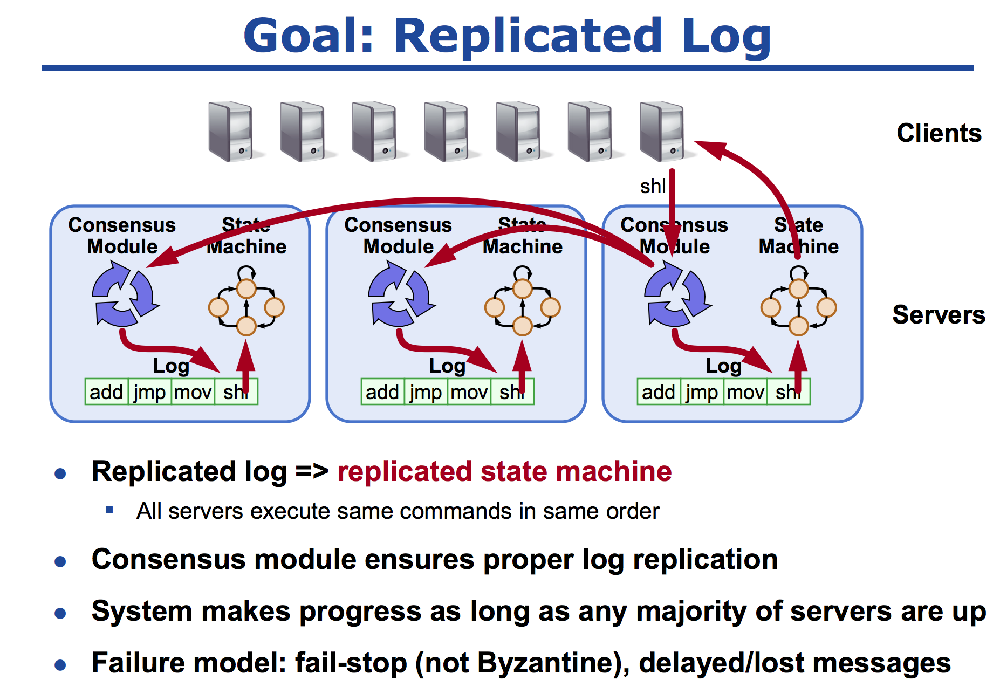
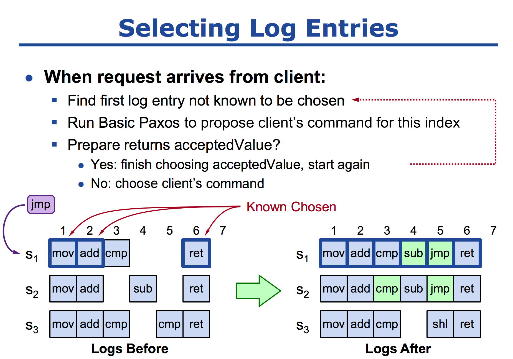

# 老司机带你用 Go 语言实现 Paxos 算法

&emsp;&emsp;在理论计算机科学中，CAP定理（CAP theorem），又被称作布鲁尔定理（Brewer's theorem），它指出对于一个分布式计算系统来说，不可能同时满足以下三点：

1. 一致性（Consistence），等同于所有节点访问同一份最新的数据副本；
2. 可用性（Availability），每次请求都能获取到非错的响应——但是不保证获取的数据为最新数据；
3. 分区容错性（Network partitioning），以实际效果而言，分区相当于对通信的时限要求。系统如果不能在时限内达成数据一致性，就意味着发生了分区的情况，必须就当前操作在 C 和 A 之间做出选择。

## 上车

&emsp;&emsp;今天说说一致性，分布式系统中的节点通信存在两种模型：共享内存（Shared memory）和消息传递（Messages passing）。

&emsp;&emsp;基于消息传递通信模型的分布式系统，不可避免的会发生以下错误：进程可能会慢、被杀死或者重启，消息可能会延迟、丢失、重复。在基础 Paxos 场景中，先不考虑可能出现消息篡改即拜占庭错误的情况。Paxos 算法解决的问题是在一个可能发生上述异常的分布式系统中如何就某个值达成一致，保证不论发生以上任何异常，都不会破坏决议的一致性。一个典型的场景是，在一个分布式数据库系统中，如果各节点的初始状态一致，每个节点都执行相同的操作序列，那么他们最后能得到一个一致的状态。为保证每个节点执行相同的命令序列，需要在每一条指令上执行一个“一致性算法”以保证每个节点看到的指令一致。一个通用的一致性算法可以应用在许多场景中，是分布式计算中的重要问题，因此从 20 世纪 80 年代起对于一致性算法的研究就没有停止过。

## 发车 （Paxos 算法）

&emsp;&emsp;Paxos 算法就是通过两个阶段确定一个决议：

- Phase1：确定谁的编号最高，只有编号最高者才有权利提交 Proposal（提议：给定的具体值）；
- Phase2：编号最高者提交 Proposal，如果没有其他节点提出更高编号的 Proposal，则该提案会被顺利通过，否则整个过程就会重来。

&emsp;&emsp;结论就是这个结论，至于整个过程的推导，就不在这里展开细说了。但是有一点需要注意的是，在过程第一阶段，可能会出现活锁。你编号高，我比你更高，反复如此，算法永远无法结束。可使用一个“Leader”来解决问题,这个 Leader 并非我们刻意去选出来一个，而是自然形成出来的。同样再次也不展开讨论了，本篇主要是以 Code 为主的哈！

### Phase1

``` go
func (px *Paxos)Prepare(args *PrepareArgs, reply *PrepareReply) error {
	px.mu.Lock()
	defer px.mu.Unlock()
	round, exist := px.rounds[args.Seq]
	if !exist {
		//new seq  of commit,so need new
		px.rounds[args.Seq] = px.newInstance()
		round, _ = px.rounds[args.Seq]
		reply.Err = OK
	}else {
		if args.PNum > round.proposeNumber {
			reply.Err = OK
		}else {
			reply.Err = Reject
		}
	}
	if reply.Err == OK {
		reply.AcceptPnum = round.acceptorNumber
		reply.AcceptValue = round.acceptValue
		px.rounds[args.Seq].proposeNumber = args.PNum
	}else {
		//reject
	}
	return nil
}
```

&emsp;&emsp;在 Prepare 阶段，主要是通过 RPC 调用，询问每一台机器，当前的这个提议能不能通过，判断的条件就是，当前提交的编号大于之前的其他机器 Prepare 的编号，代码 `if args.PNum > round.proposeNumber` 的判断。还有一个就是，如果之前一台机器都没有通过，即使当前是第一个提交 Prepare 的机器，那就直接同意通过了。代码片段：

``` go
round, exist := px.rounds[args.Seq]
	if !exist {
		//new seq  of commit,so need new
		px.rounds[args.Seq] = px.newInstance()
		round, _ = px.rounds[args.Seq]
		reply.Err = OK
	}
```

&emsp;&emsp;在完成逻辑判断过后，如果本次提议是通过的，那么还需返回给提议者，已经通过提议和确定的值。代码片段：

``` go
if reply.Err == OK {
	reply.AcceptPnum = round.acceptorNumber
	reply.AcceptValue = round.acceptValue
	px.rounds[args.Seq].proposeNumber = args.PNum
}
```

### Phase2

``` go
func (px Paxos)Accept(args *AcceptArgs, reply *AcceptReply) error {
	px.mu.Lock()
	defer px.mu.Unlock()
	round, exist := px.rounds[args.Seq]
	if !exist {
		px.rounds[args.Seq] = px.newInstance()
		reply.Err = OK
	}else {
		if args.PNum >= round.proposeNumber {
			reply.Err = OK
		}else {
			reply.Err = Reject
		}
	}
	if reply.Err == OK {
		px.rounds[args.Seq].acceptorNumber = args.PNum
		px.rounds[args.Seq].proposeNumber = args.PNum
		px.rounds[args.Seq].acceptValue = args.Value
	}else {
		//reject
	}
	return nil
}
```

&emsp;&emsp;在 Accept 阶段基本和 Prepare 阶段如出一辙咯。判断当前的提议是否存在，如果不纯在表明是新的，那就直接返回 OK 咯！

``` go
round, exist := px.rounds[args.Seq]
if !exist {
	px.rounds[args.Seq] = px.newInstance()
	reply.Err = OK
}
```

&emsp;&emsp;然后同样判断提议号是否大于等于当前的提议编号，如果是，那同样也返回 OK 咯，否者就拒绝。

``` go
if args.PNum >= round.proposeNumber {
	reply.Err = OK
}else {
	reply.Err = Reject
}
```

&emsp;&emsp;与此重要的一点就是，如果提议通过，那么就需设置当轮的提议编号和提议的值。

``` go
if reply.Err == OK {
	px.rounds[args.Seq].acceptorNumber = args.PNum
	px.rounds[args.Seq].proposeNumber = args.PNum
	px.rounds[args.Seq].acceptValue = args.Value
}
```

&emsp;&emsp;整个使用过程中使用了 Map 和数组来存储一些辅助信息，Map 主要存储的是，每一轮的投票被确定的结果，Key 表示每一轮的投票编号，Round 表示存储已经接受的值。Completes 数组主要是用于存储在使用的过程中，已经确定完成了的最小的编号。

``` go
	rounds     map[int]*Round //cache each round  paxos result key is seq value is value
	completes  [] int         //maintain peer min seq of completed

func (px *Paxos)Decide(args *DecideArgs, reply *DecideReply) error {
	px.mu.Lock()
	defer px.mu.Unlock()
	_, exist := px.rounds[args.Seq]
	if !exist {
		px.rounds[args.Seq] = px.newInstance()
	}
	px.rounds[args.Seq].acceptorNumber = args.PNum
	px.rounds[args.Seq].acceptValue = args.Value
	px.rounds[args.Seq].proposeNumber = args.PNum
	px.rounds[args.Seq].state = Decided
	px.completes[args.Me] = args.Done
	return nil
}
```

&emsp;&emsp;同时 Decide 方法，用于提议者来确定某个值，这个映射到分布式里面的状态机的应用。



&emsp;&emsp;客户段通过提交指令给服务器，服务器通过 Paxos 算法是现在多台机器上面，所有的服务器按照顺序执行相同的指令，然后状态机对指令进行执行最后每台机器的结果都是一样的。



## 到站

&emsp;&emsp;在分布式环境之中，网络故障宕机属于正常现象。如果一台机器宕机了，过了一段时间又恢复了，那么他宕机的时间之中，怎么将之前的指令恢复回来？当他提交一个 jmp 指令的时候，索引 1、2 都是已经确定了的指令，所以可以直接从索引 3 开始，当他提交 Propser（jmp）的时候，会收到 s1、s3 的返回值（cmp），根据 Paxos 算法后者认同前者的原则，所以他会在 Phase2 阶段提交一个值为 cmp accept 的请求，最后索引为 3 的就变成了 cmp，如果说在这个阶段没有返回值，那么就选择客户端的返回值就可以了，最后就达成了一致。

源于 MIT，然后用于自己学习，[源码注释地址](https://github.com/happyer/distributed-computing)。
