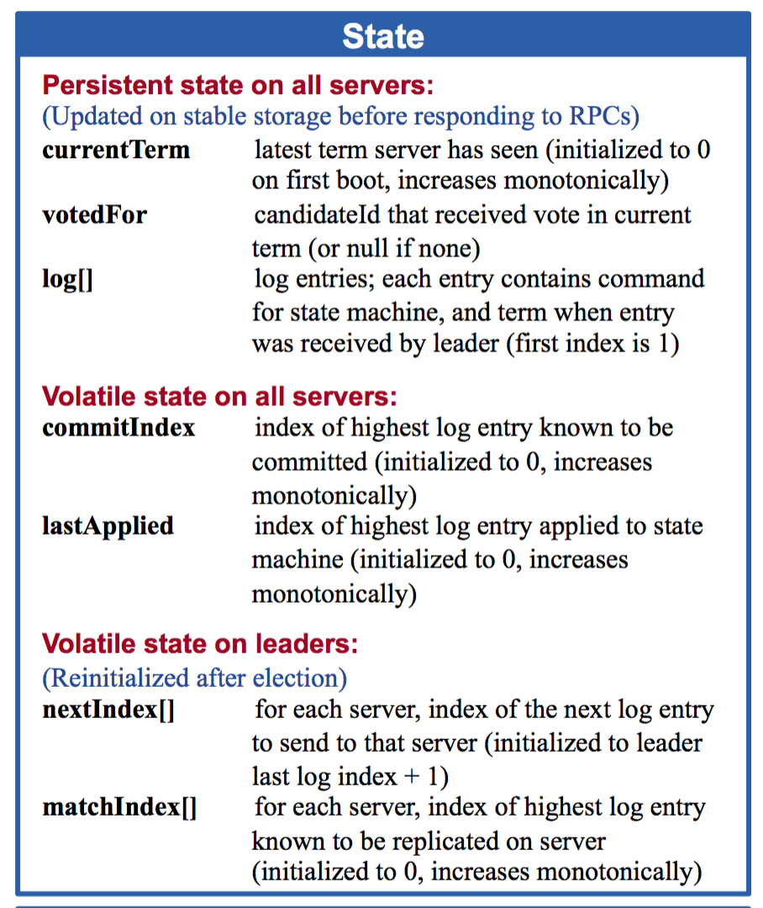
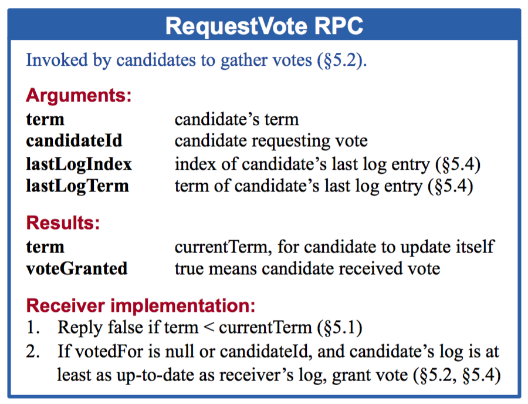
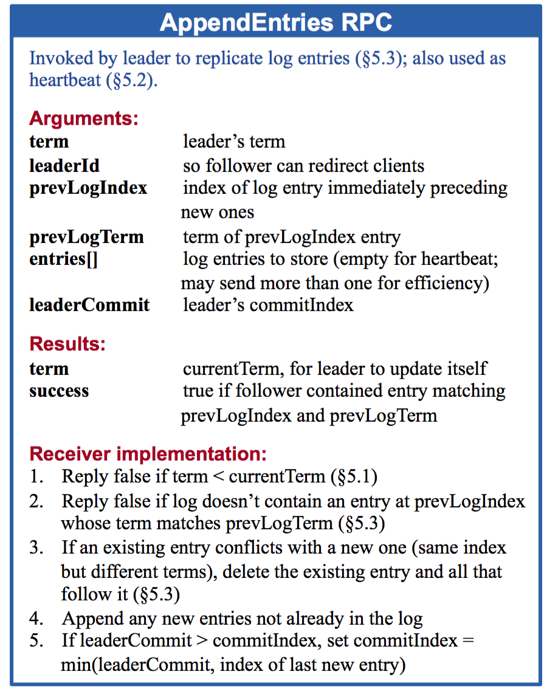
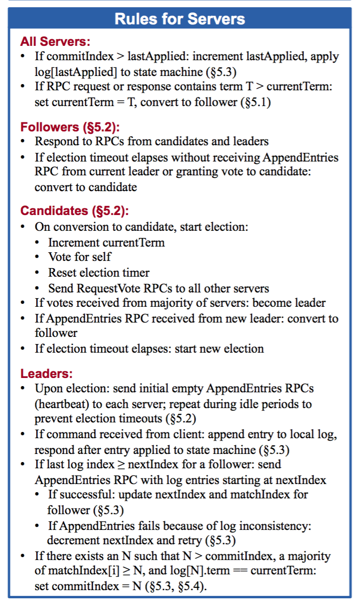

# 老司机带你用 Go 语言实现 Raft 分布式一致性协议

&emsp;&emsp;随着大型网站的各种高并发访问、海量数据处理等场景越来越多，如何实现网站的高可用、易伸缩、可扩展、安全等目标就显得越来越重要。

&emsp;&emsp;为了解决这样一系列问题，大型网站的架构也在不断发展。提高大型网站的高可用架构，不得不提的就是分布式。任何一个分布式系统都无法同时满足 Consistency（一致性），Availability（可用性），Partition tolerance（分区容错性）这三个基本需求，最多只能满足其中两项。 但是，一个分布式系统无论在 CAP 三者之间如何权衡，都无法彻底放弃一致性（Consistency），如果真的放弃一致性，那么就说明这个系统中的数据根本不可信，数据也就没有意义，那么这个系统也就没有任何价值可言。所以，无论如何，分布式系统的一致性问题都需要重点关注。

&emsp;&emsp;Raft 适用于一个管理日志一致性的协议，相比于 Paxos 协议 Raft 更易于理解和去实现它。

## 上车

&emsp;&emsp;Raft 通过选举一个领导人，然后给予他全部的管理复制日志的责任来实现一致性。领导人从客户端接收日志条目，把日志条目复制到其他服务器上，并且当保证安全性的时候告诉其他的服务器应用日志条目到他们的状态机中。拥有一个领导人大大简化了对复制日志的管理。例如：领导人可以决定新的日志条目需要放在日志中的什么位置而不需要和其他服务器商议，并且数据都从领导人流向其他服务器。一个领导人可以宕机，可以和其他服务器失去连接，这时一个新的领导人会被选举出来。

&emsp;&emsp;Raft 把时间分割成任意长度的任期，任期用连续的整数标记。每一段任期从一次选举开始，一个或者多个候选人尝试成为领导者。如果一个候选人赢得选举，然后他就在接下来的任期内充当领导人的职责。在某些情况下，一次选举过程会造成选票的瓜分。在这种情况下，这一任期会以没有领导人结束；一个新的任期（和一次新的选举）会很快重新开始。Raft 保证了在一个给定的任期内，最多只有一个领导者。

&emsp;&emsp;要实现 Raft 协议，参见下图：

&emsp;&emsp;Raft 协议将整个过程分为主要3个步骤：

1. 领导者：和其他一致性算法相比，Raft 使用一种更强的领导能力形式。比如，日志条目只从领导者发送给其他的服务器。这种方式简化了对复制日志的管理并且使得 Raft 算法更加易于理解。

2. 领导选举：Raft 算法使用一个随机计时器来选举领导者。这种方式只是在任何一致性算法都必须实现的心跳机制上增加了一点机制。在解决冲突的时候会更加简单快捷。

3. 关系调整：Raft 使用一种共同一致的方法来处理集群成员变换的问题，在这种方法中，两种不同的配置都要求的大多数机器会重叠。这就使得集群在成员变换的时候依然可以继续工作。

&emsp;&emsp;后面将通过这3个主要过程进行展开。

## 发车（领导的选举）

&emsp;&emsp;Raft 使用一种心跳机制来触发领导人选举。当服务器程序启动时，他们都是跟随者身份。如果一个跟随者在一段时间里没有接收到任何消息，也就是选举超时，然后他就会认为系统中没有可用的领导者然后开始进行选举以选出新的领导者。要开始一次选举过程，跟随者先要增加自己的当前任期号并且转换到候选人状态。然后他会并行的向集群中的其他服务器节点发送请求投票的 RPCs 来给自己投票。候选人的状态维持直到发生以下任何一个条件发生的时候，(a) 他自己赢得了这次的选举，(b) 其他的服务器成为领导者，(c) 一段时间之后没有任何一个获胜的人。当一个候选人从整个集群的大多数服务器节点获得了针对同一个任期号的选票，那么他就赢得了这次选举并成为领导人。每一个服务器最多会对一个任期号投出一张选票，按照先来先服务的原则。

&emsp;&emsp;Raft 使用投票的方式来阻止候选人赢得选举除非这个候选人包含了所有已经提交的日志条目。候选人为了赢得选举必须联系集群中的大部分节点，这意味着每一个已经提交的日志条目肯定在这些服务器节点中至少存在一个上面。如果候选人的日志至少和大多数的服务器节点一样新，那么他一定持有了所有已经提交的日志条目。请求投票 RPC 实现了这样的限制： RPC 中包含了候选人的日志信息，然后投票人会拒绝掉那些日志没有自己新的投票请求。

&emsp;&emsp;Raft 通过比较两份日志中最后一条日志条目的索引值和任期号定义谁的日志比较新。如果两份日志最后的条目的任期号不同，那么任期号大的日志更加新。如果两份日志最后的条目任期号相同，那么日志比较长的那个就更加新。

## 到站（日志复制）

&emsp;&emsp;一旦一个领导人被选举出来，他就开始为客户端提供服务。客户端的每一个请求都包含一条被复制状态机执行的指令。领导人把这条指令作为一条新的日志条目附加到日志中去，然后并行的发起附加条目 RPCs 给其他的服务器，让他们复制这条日志条目。当这条日志条目被安全的复制，领导人会应用这条日志条目到它的状态机中然后把执行的结果返回给客户端。如果跟随者崩溃或者运行缓慢，再或者网络丢包，领导人会不断的重复尝试附加日志条目 RPCs（尽管已经回复了客户端）直到所有的跟随者都最终存储了所有的日志条目。

&emsp;&emsp;Raft 的日志机制来维护一个不同服务器的日志之间的高层次的一致性。这么做不仅简化了系统的行为也使得更加可预计，同时他也是安全性保证的一个重要组件。Raft 维护着以下的特性，这些同时也组成了的日志匹配特性：

1. 如果在不同的日志中的两个条目拥有相同的索引和任期号，那么他们存储了相同的指令。
2. 如果在不同的日志中的两个条目拥有相同的索引和任期号，那么他们之前的所有日志条目也全部相同。

&emsp;&emsp;第一个特性来自这样的一个事实，领导人最多在一个任期里在指定的一个日志索引位置创建一条日志条目，同时日志条目在日志中的位置也从来不会改变。第二个特性由附加日志 RPC 的一个简单的一致性检查所保证。在发送附加日志 RPC 的时候，领导人会把新的日志条目紧接着之前的条目的索引位置和任期号包含在里面。如果跟随者在它的日志中找不到包含相同索引位置和任期号的条目，那么他就会拒绝接收新的日志条目。

&emsp;&emsp;一致性检查就像一个归纳步骤：一开始空的日志状态肯定是满足日志匹配特性的，然后一致性检查保护了日志匹配特性当日志扩展的时候。因此，每当附加日志 RPC 返回成功时，领导人就知道跟随者的日志一定是和自己相同的了。

## 下车

源于 MIT，然后用于自己学习，[源码注释地址](https://github.com/happyer/distributed-computing)。
