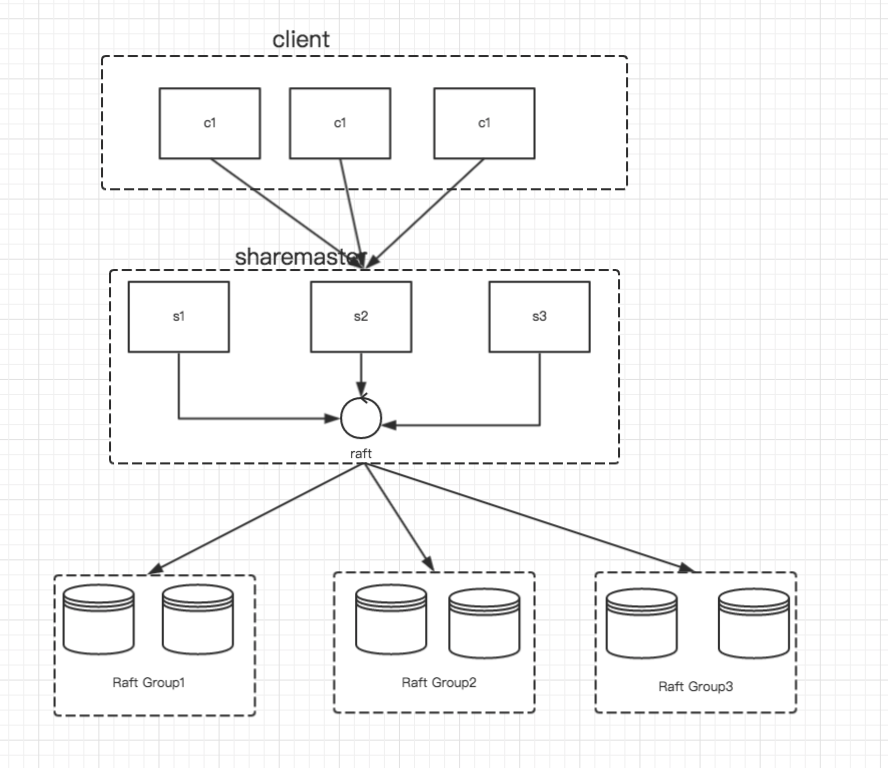

# 老司机带你用 Go 语言实现分布式数据库

该分布式数据使用了 Raft 协议作为一致性协议为基础，Raft 协议的实现在 [《老司机带你用 Go 语言实现 Raft 分布式一致性协议》](src/raft)。

一个良好的分布式数据实现包括以下几个方面：

1. 可用性，即在一些机器各种故障的情况下是否能够继续提供服务(A)；
2. 在分布式环境中，机器之间通过网络通信，它们是否能容忍网络分区(P）；
3. 在数据分布到各个机器之中，他们的数据是否能够保持一致（C）；
4. 在之前的大数据环境之中，对于分布式是否支持水平扩展（Shard）也成为了一个必不可少的功能；

上述是 CAP 理论和分布式拓展的必要功能。在很多系统里面，一致性上面做了一些妥协，使用了弱一致性协议。当然像 Dynamo 这样提供 W + R > N 这种协议的，让用户选择一致性也是一种新的思路，对应的开源版本：Cassandra。

### Shard

分区作为分布式里面一个重要的的特性，它可以通过增加机器来达到增加吞吐量的目的。与此同时，也带来了一些对于每一个 Shard 的负载挑战。
所以通用的做法是，客户端通过提供一个 Partition 接口，让用户自己决定分为的规则。

### 架构

Sharemaster 主要负责根据 Client 提供的分区规则，将数据储存在不同的 Group 中，为了 Sharemaster 有多台机器组成，他们之间使用 Raft 协议来保证一致性。每一个 Group 由多台机器组成，他们之间也是通过 Raft 协议来保证一致性。

在实现分布式数据之中为了简单起见，将数据直接放入到一个 Map 之中，这里只是想告诉你整个流程是这样的。
持续更新中，后续会把 LSM 融入进来。

[源码注释地址](https://github.com/happyer/distributed-computing)。

扫描二维码，关注我的个人微信公众号：

